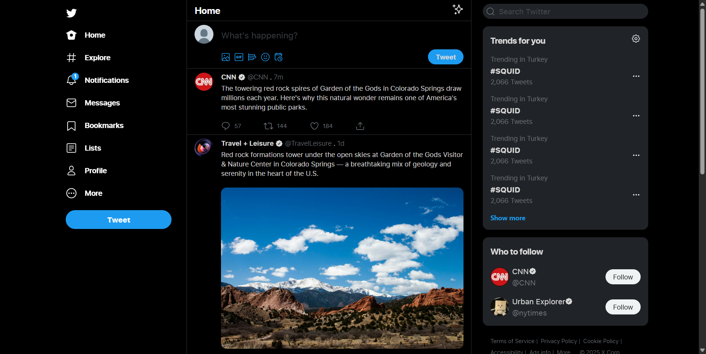

# Twitter Clone

> A static Twitter UI clone built with Next.js 15 and Tailwind CSS. Featuring a clean, modern interface that replicates the look and feel of Twitter's home feed with pre-loaded sample tweets.

[](https://nextjs.org/)
[](https://react.dev/)
[](https://www.typescriptlang.org/)
[](https://tailwindcss.com/)

## 📋 Table of Contents

- [About](#about)
- [Features](#features)
- [Tech Stack](#tech-stack)
- [Prerequisites](#prerequisites)
- [Installation](#installation)
- [Getting Started](#getting-started)
- [Project Structure](#project-structure)
- [Available Scripts](#available-scripts)
- [Screenshots](#screenshots)

## 📖 About

This is a **static UI clone** of Twitter's home feed. It showcases a clean, professional interface without backend functionality. Perfect for learning Next.js, TypeScript, and Tailwind CSS, or as a starting point for building a real social media application.

## ✨ Features

- 🎨 Clean and responsive Twitter UI
- 📱 Mobile-friendly design
- 🐦 Pre-loaded sample tweets with user profiles
- ❤️ Interactive like, retweet, and reply buttons (UI only)
- 🔥 Trending section on the sidebar
- 🌙 Dark theme with Twitter's official color scheme
- ⚡ Fast static rendering with Next.js
- 🎯 Modular component structure

## 🛠 Tech Stack

- **Framework**: [Next.js 15.3](https://nextjs.org/) - React meta-framework
- **Language**: [TypeScript 5](https://www.typescriptlang.org/) - Type-safe JavaScript
- **Styling**: [Tailwind CSS 4](https://tailwindcss.com/) - Utility-first CSS framework
- **UI Library**: React 19
- **Package Manager**: npm, yarn, pnpm, or bun
- **Code Quality**: ESLint

## 📦 Prerequisites

Ensure you have the following installed:

- **Node.js** (v18.0.0 or higher)
- **npm**, **yarn**, **pnpm**, or **bun**
- **Git**

## 🚀 Installation

### 1. Clone the Repository

```bash
git clone git@github.com:rainierXcode/Twitter-Clone.git
cd Twitter-Clone
```

### 2. Install Dependencies

```bash
npm install
# or
yarn install
# or
pnpm install
# or
bun install
```

## 🏃 Getting Started

### Start the Development Server

```bash
npm run dev
```

Open [http://localhost:3000](http://localhost:3000) in your browser to see the application.

### Build for Production

```bash
npm run build
npm start
```

## 📁 Project Structure

```
src/
├── app/                        # Next.js app directory
│   ├── page.tsx               # Home page
│   └── layout.tsx             # Root layout
├── components/
│   ├── icons.tsx              # SVG icon components
│   └── layouts/
│       ├── Sidebar.tsx        # Navigation sidebar
│       └── Home/
│           ├── Tweet.tsx      # Individual tweet component
│           ├── TweetEditor.tsx # Tweet compose area
│           └── Trends.tsx     # Trending section
├── data/
│   └── allTweetObject.ts      # Sample tweets data
└── assets/                    # Images and profile pictures
```

## 🔧 Available Scripts

| Command           | Description                               |
| ----------------- | ----------------------------------------- |
| `npm run dev`     | Start the development server on port 3000 |
| `npm run build`   | Create an optimized production build      |
| `npm start`       | Start the production server               |
| `npm run lint`    | Run ESLint to check code quality          |
| `npm run analyze` | Analyze bundle size with Bundle Analyzer  |

## 📸 Screenshots



## 📝 License

This project is open source and available under the MIT License.

---

**Like this project?** Consider giving it a ⭐ star on GitHub!
